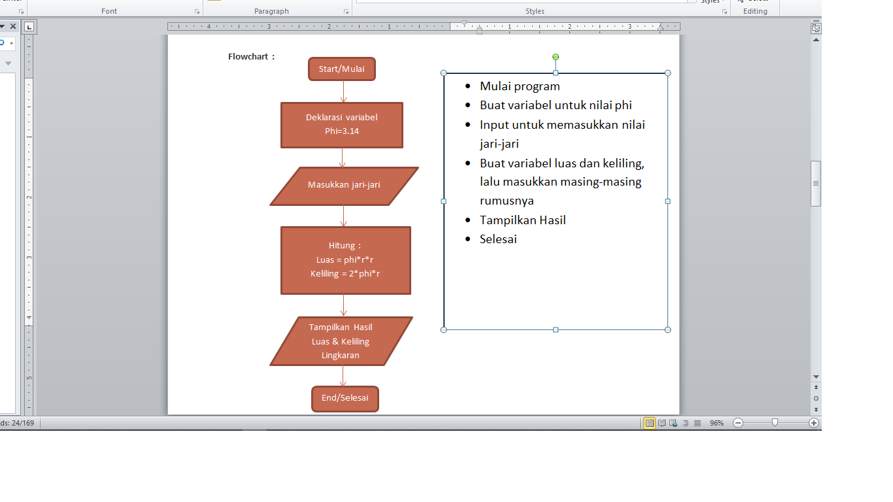
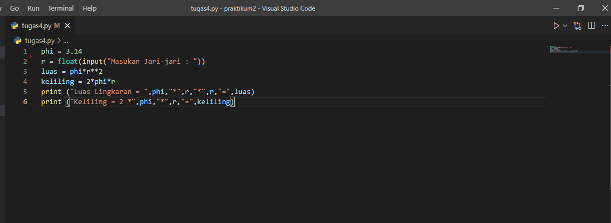
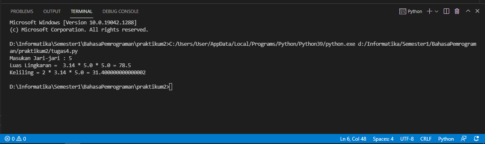

# praktikum2

## Program menghitung luas dan keliling lingkaran
Rumus :
Luas        = phi*r*r
keliling    = 2*phi*r
### Flowchart

### Buat Program Menghitung Luas & Keliling lingkaran
Buatlah kode program seperti gambar berikut :

Penjelasan: 
 1.Buatlah variabel phi yang bernilai 3.14
 2.Selanjutnya kita memerlukan nilai jari-jari. Buat variabel r yang nanti nialinya akan di masukan oleh pengguna pada   layar console. Kita menggunakan fungsi input() yang nilainya di konversi ke tipe data float (bilangan riil).
 3.Buat variabel luas yang value nya merupakan rumus luas lingkaran
 4.Buat variabel keliling yang value nya merupakan rumus keliling lingkaran
 5.Kemudian ketika user telah memasukkan nilai jari-jari dan menekan enter, maka print hasilnya.

 ### Output/Hasil dari program diatas
 
 ini adalah contoh hasil dari program yang kita buat, dimana user memasukkan nilai 5 sebagai jari-jari. Kemudian program menghitung hasilnya dan menampilkannya.